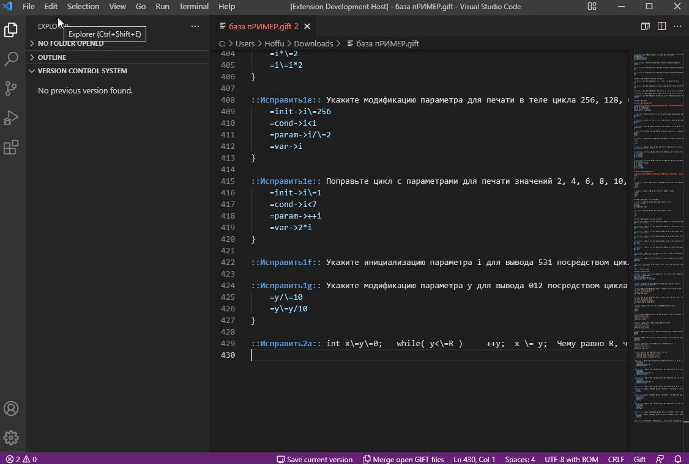

# GIFTFilesControl

Простое расширение для Visual Studio Code, упрощающее работу с файлами формата GIFT.

## Использование

По нажатию соответствующих кнопок сохраняется версия текущего файла и сливаются все открытые файлы формата GIFT. Переход к раннее сохраненой версии осуществляется путем выбора версии в древовидной структуре и нажатием на неё.

## Требования

Для работы расширения требуется основное приложение Visual Studio Code.

## Конфигурация расширения

Конфигурация не требуется

## Тестирование

Для всех функций и методов написаны unit-тесты.

## Известные проблемы

Известных проблем на данный момент не выявленно.

## Обратная связь

Если у вас есть вопросы, проблемы, отчеты об ошибках и т. д., сообщите о проблеме в системе отслеживания проблем этого репозитория.

### 1.0.0

Первый выпуск расширения GIFTFilesControl.

### Скачать

[Скачать](tsconfig.json)
